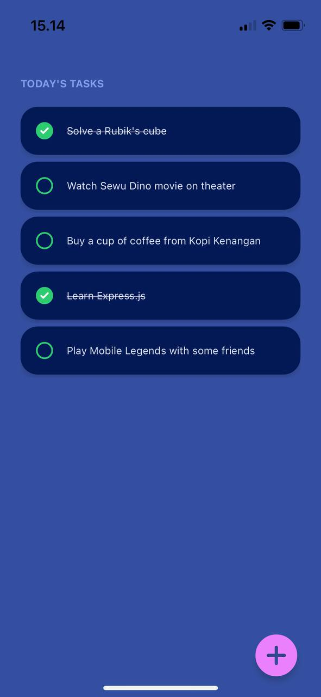
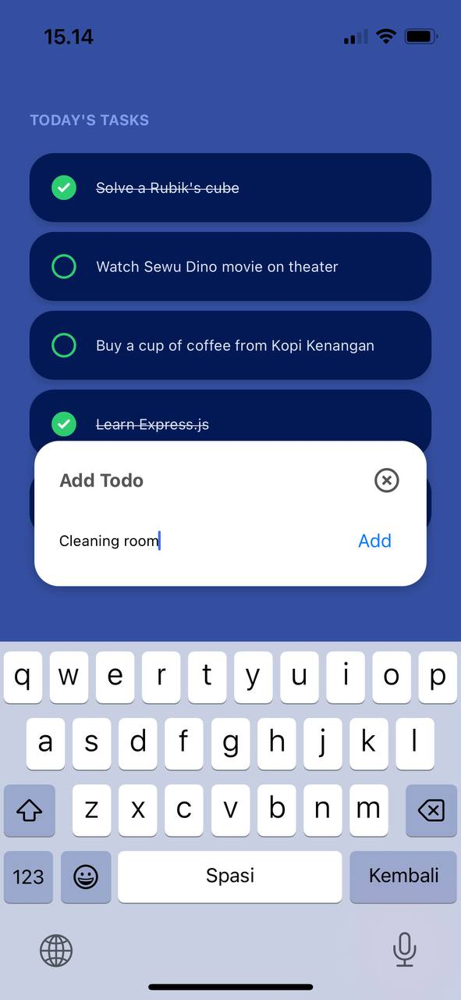
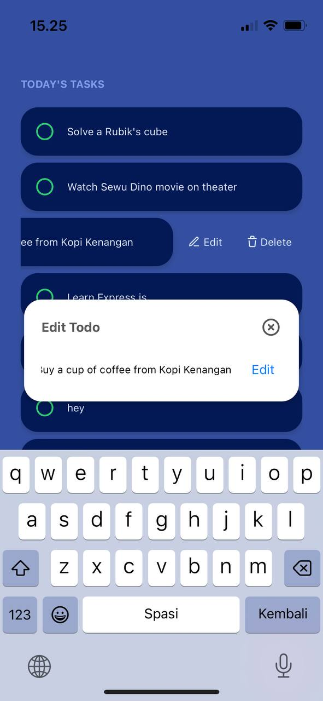
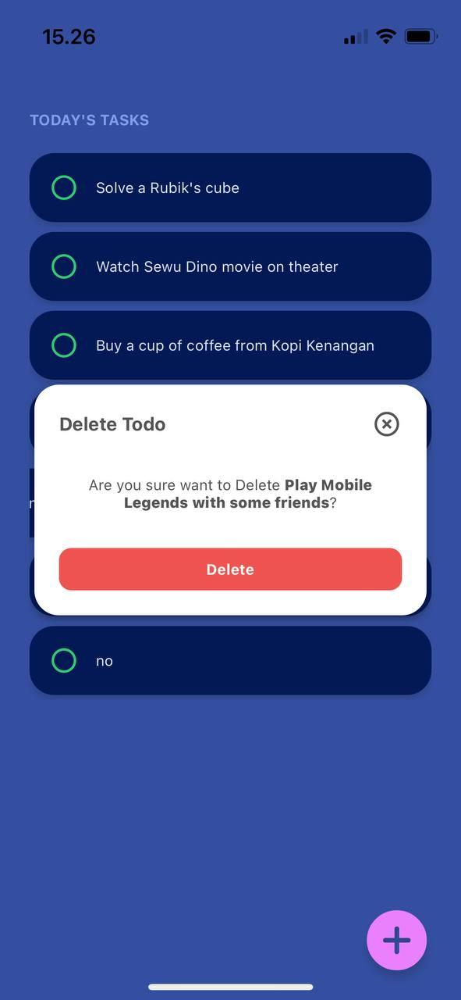

# Simple Todo App with Redux

React Native Todo App using Typescript, Redux-Toolkit and Supabase.

> `main` branch : using external API

> `local` branch : just local data

## Feature

- View Todo
- Create Todo
- Update Todo
- Delete Todo

## Setup

1. Clone this repo

2. Install local dependencies:
   ```sh
   npm install
   # or
   yarn
   ```

## Starting App

1. Open Terminal in project folder
   ```sh
   npx expo start
   ```
2. Open Android / iOS emulator or download Expo Go from Play Store / App Store
3. Follow the instruction

APK with API : [Download](https://expo.dev/artifacts/eas/7ofNdPXb1KatNZt7v24zbL.apk)

APK local : [Download](https://expo.dev/artifacts/eas/tcSq7SrexUJfErqQCDraVF.apk)

Design inspiration : [Dribble](https://dribbble.com/shots/14153121-ToDo-App-Dark-Theme)

## Screenshot

### View Todo



### Add Todo



### Edit Todo



### Delete Todo


